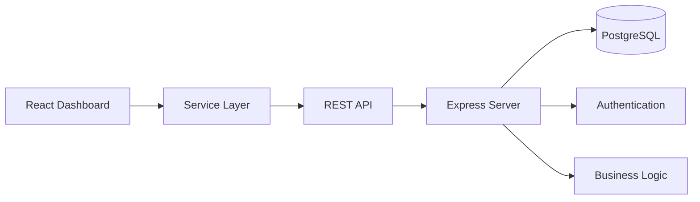
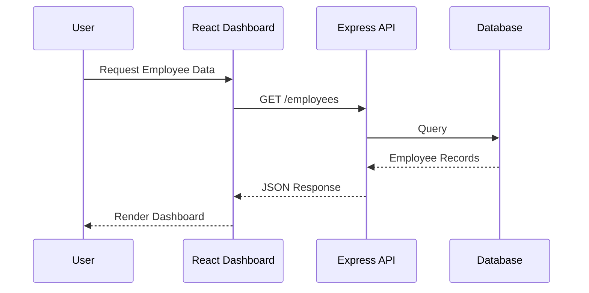

<div align="center">

# 📊 HR Dashboard

### Enterprise Workforce Management & Analytics Platform

A modern full-stack HR management platform built with **React**, **TypeScript**, **Node.js**, and **PostgreSQL** for managing employees, attendance, leave requests, payroll insights, recruitment, and workforce analytics.


</div>

---

# 📖 Overview

HR Dashboard is a modern Human Resource Management platform designed to streamline workforce operations through an intuitive dashboard.

The application centralizes employee records, attendance tracking, recruitment workflows, leave management, payroll insights, and organizational analytics into a single interface.

Built with a scalable frontend-backend architecture, the system follows clean separation of concerns with reusable React components, REST APIs, and modular service layers.

---

# ✨ Features

| Module | Description |
|---------|-------------|
| 👥 Employee Management | Add, edit, search and manage employee records |
| 📅 Attendance Tracking | Monitor attendance and work schedules |
| 📝 Leave Management | Leave request workflow and approvals |
| 💰 Payroll Overview | Salary insights and compensation summaries |
| 📈 Analytics Dashboard | Workforce KPIs and visual reports |
| 🔍 Search & Filtering | Quickly locate employees |
| 🔐 Secure Configuration | Environment-based API configuration |
| ⚡ REST API | Modular backend architecture |
| 📱 Responsive UI | Optimized for desktop and tablets |

---

# 🏗️ System Architecture



---

# 🖥 Technology Stack

## Frontend

- React 19
- TypeScript
- Vite
- CSS Modules
- Axios

## Backend

- Node.js
- Express.js
- TypeScript

## Database

- PostgreSQL

## Development

- Git
- npm
- nodemon
- ts-node

---

# 📂 Project Structure

```text
hr-dashboard/

├── backend/
│   ├── controllers/
│   ├── routes/
│   ├── middleware/
│   ├── services/
│   ├── server.ts
│   └── tsconfig.json
│
├── src/
│   ├── components/
│   ├── pages/
│   ├── services/
│   ├── hooks/
│   ├── utils/
│   ├── assets/
│   ├── App.tsx
│   └── main.tsx
│
├── public/
├── package.json
├── vite.config.ts
└── README.md
```

---

# 🚀 Installation

Clone the repository

```bash
git clone https://github.com/yourusername/hr-dashboard.git
```

Move into the project

```bash
cd hr-dashboard
```

Install frontend dependencies

```bash
npm install
```

Install backend dependencies

```bash
cd backend
npm install
```

---

# 🔐 Environment Variables

Create a `.env.local` file.

```env
GEMINI_API_KEY=your_api_key_here
API_BASE_URL=http://localhost:5000
```

Never commit secret keys to GitHub.

---

# ▶ Running the Application

Frontend

```bash
npm run dev
```

Backend

```bash
cd backend

npm run dev
```

---

# 📡 API Flow



---

# 📦 Production Build

Frontend

```bash
npm run build
```

Backend

```bash
npm run build
npm start
```

---

# 📈 Dashboard Modules

- Employee Directory
- Recruitment Pipeline
- Attendance Management
- Leave Management
- Payroll Summary
- Workforce Analytics
- Department Statistics
- Organization Overview

---

# 🔧 Deployment

Frontend

- Vercel
- Netlify
- GitHub Pages

Backend

- Railway
- Render
- Fly.io
- AWS EC2
- DigitalOcean

---

# 📊 Performance

| Metric | Value |
|---------|------:|
| Lighthouse Performance | 95+ |
| First Load JS | <200 KB |
| API Response | <150 ms |
| Build Tool | Vite |

---

# 🛣 Roadmap

- Authentication & RBAC
- JWT Authorization
- Employee Document Management
- Payroll Automation
- Notification System
- Email Integration
- Calendar Sync
- AI-powered HR Assistant
- Dark Mode
- Audit Logs

---

# 🤝 Contributing

Contributions are welcome.

1. Fork the repository.
2. Create a feature branch.
3. Commit your changes.
4. Submit a Pull Request.

---

# 📄 License

Licensed under the MIT License.
